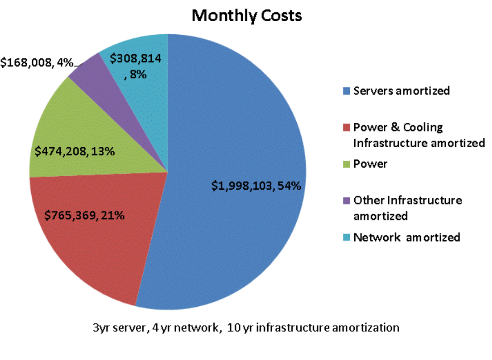
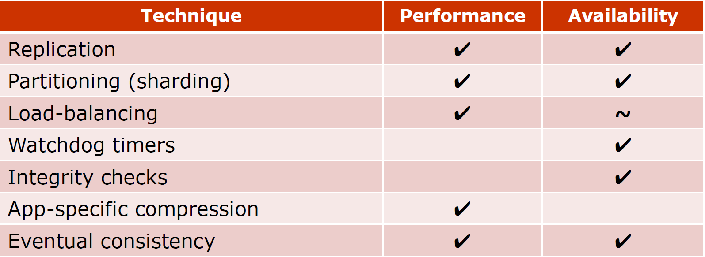

# ECE5710 Datacenter

[TOC]

## Lecture 1

### 1.1 Questions when reading paper

- What is the problem the paper tackles?
- Why is it important?
- How do thy tackle it?
- Advantages/disadvantages?
- Open questions for future work?
- Broader implications?

### 1.2 What is a Datacenter?

- The **compute infrastructure** for internet-scale services & cloud computing
- Both consumer and enterprise services

***A simplistic view***

- scaled-up/out version of machine rooms for enterprise computing
- A large collection of commodity components
  - PC-based servers (CPUs, DRAM, disks)
  - Ethernet networking
  - Commodity OS and software stack
  - 10s to 100s of thousands of nodes
- High-bandwidth networking (10Gbps -> 40 Gbps -> 100 Gbps)
- Power delivery, cooling, UPS (**50-200MW per DC**)
- System software for DC management (centralized or distributed)
- Software that implements internet services

### 1.3 Why we need a datacenter?

- Some applications need big machines
- Improve the user experience
  - flexibility, cost-efficiency
- Vendor benefits
  - faster application development
  - lower cost

### 1.4 DC Hardware

- Computer & Memory
  - A PC-based server (most of them x86)
  - Custom Linux OS (optimized for latency)
  - 1U, 2U, or blade from factors are popular
    - E.g. 2 processor sockets, tens of GB of DRAM, 2 disks, ...
- Networking
  - 10Gbps ehernet links to rack switch
  - A few 10 Gbps links to cluster level switches

- Storage

  - Distributed file system using disks on servers (GFS)

    - better fault-tolerance across nodes, lower cost, better scalability

  - Netork attached storage (NAS) devices

  - **Interesting** **observations**

    - Remote memory is often faster than locak disk

    - Bandwidth bottlenecks

      

      **The network's latency is lower than disk's**

## Lecture 2

- project list will come soon on Piazza
- sign up for paper presentation
- get permission number before Jan 27, if not, send email

### 2.1 Total Cost of Ownership (TCO)

- The key metric in datacenters
  - Scalable capabilities at low TCO (large-scale needs low cost)
  - **Key** competitive advantage
- TCO components
  - Capital expenses (CAPEX)
    - Facilities, compute, storage, networking
  - Operational expenses (OPEX)
    - Energy, maintenance, employees
- Keep in mind
  - Facilities & equipment amortized over a certain period
  - cost of money (interest rate)

#### 2.1.1 Efficiency in DCs

- PUE (Power Usage Effectiveness) standard DC metric for how much power goes towards useful work
  $$
  PUE = \frac{Total Facility Power}{IT Equipment Power}
  $$

- Idealy PUE=1.0 (no overhead from cooling)
- Used to be ~2.0
- Best today 1.07 (Facebook), 1.12 (Google)

### 2.2 Cost Model: System CAPEX and OPEX

- Servers = Monthly 2000K $ CAPEX 
- Networking = Monthly 309K $ CAPEX
- Power = Monthly 475K $ OPEX
- People = 85K $ OPEX
- Network bandwidth costs to internet
- Vendor maintenance fees + sysadmins

Summary:

- 34% costs related to power 
- Networking high 8% of overall costs; 15% of server costs

#### 2.2.1 Enterprise Vs Internet-scale Computing: a Cost Perspective

- Enterprise computing approach
  - Largest cost is people (~100:1)
  - Enterprise interests focus on cosolidation & utilization

- Internet-scale services approach
  - Largest costs is server H/W
    - people cost under 10% & often under 5%
    - followed by cooling, power, distribution, power
  - Services intersts centered around work-done-per-$(or watt)
- Obvervations
  - People cost shifts from top to nearly irrelevant
  - Focus instead on work done / $ & work done/watt

#### 2.2.2 Cost analysis

Datacenter Applications

- Batch application (cares about **throughput**)
- Interactive services (cares about tail **latency**)
- Native processes, containers, or virtual machines

#### 2.2.3 Example 3-tier App: WebMail

- 1st tier: protocol processing
- 2nd tier: application logic
- 3rd tier: data storage

**Why Tiered Application?**

- Simplifies aoolication application
- Simplifies performance tuning
- Simplifies reliable operation

Disadvantages?

- High request level application
- High workload chun
- Platform homogeneity
- Require fault-free operation

### 2.3 Performance Metrics

- Throughput
- Quality of Service (QoS)
  - Latency of individual requests (90th, 95th, 99th percentile)
- Interesting notes
  - distribution matters, not just average
  - Optimizing thoughput often hurts latency
    - optimizing latency often hurts power consumtion

**Reason for Variability**

- Interference
- Heterogeneity
- Power limits & energy management
- Input load
- Often hurt avg performance as well

**Reducing Variability**

- Differentiate service classes
  - Production->high-priority requests / apps
  - Typically will prioritize requests from interactive apps
- Overprovisioning: allocate more resources than needed
- Reduce head-of-line blocking
  - Some requests are much more expensive than others->can block the simpler requests from executing
  - Time slicing: break the long requests into smaller components to allow shorter requests to interleave with them
- Manage background tasks
  - Disallow events such as log compaction or garbage collection during periods of peak user load
  - Synchronize background tasks across machines

**Reducing Tail Latency**

- Accept service time variability and work around it
- Replicate requests
- Address tail-latency through long-term techniques

**Address tail-latency though long-term techniques**

- data in DCs is distributed across the machines
- some data hotter than others
- divide data in smaller, micro-partitions->easier shuffling, better load balancing, easier recovery
- Detect the partitions that will cause imbalance and replicate them more replication factor
- put slow machines on probation->use other machines until performance revocers

### 2.4 Reliability & Availability

- Common goal for services: 99.99% availability
- But with thousands of nodes, things will crash

#### 2.5 Consistency

- Multiple datacenters implies dealing with consistency issues

#### 2.6 Performance / Availability Techniques in DCs

Difference between load-balancing and partitioning ?

### 2.7 What else is running in a DC

- Platform-level software
- Cluster-level infrastructure
- Application services

## Lecture 3 Hardware

## Lecture 4 Power Management

## Lecture 5 Power Management

Custom-design servers

- Configurations optimized for application needs
- Few configurations to allow reuse across many applications
- Roughly constant power budget per volume

What are issues to consider?

- price goes exponentially when increase socket number
- performance

**Large VS small servers**

- when communication is high, data needs to be distrbuted to each server, so leading higher latency for large cluster
- performance may be limited for Internet bandwidth, in this case, smaller server is more efficient and cost-effective

