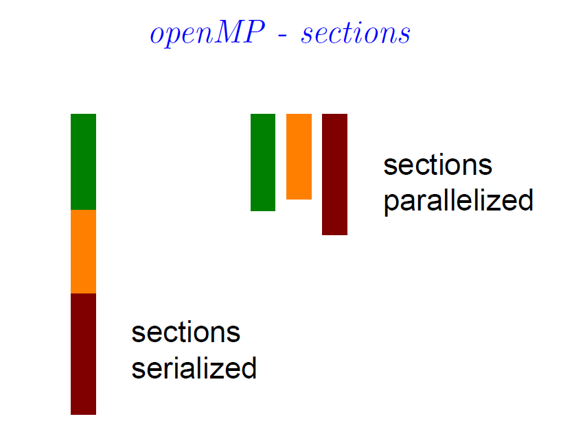

# ECE 5720 Parallel Computing

[TOC]

## Lecture 1

<font color="red">Need for fast computers in engineering</font>

- data mining, machine learning, computational finance
- video games, medical imaging, drug design, etc

Parallelism is not a new idea

- 1960's theory
- Early parallel computers
- VLSI revolution of 80's
- parallelism in CPU invisible to the programmer

**Cost of Algorithms**

- cost of arithmetic/logic operations 运算，例如加减乘，位移
- cost of moving data - local vs. remote read/write 移动数据所需的时间
- cost of control 控制所需

<font color="red">Potential Question here</font>

### 1.1 Most common "walls"

#### 1.1.1 Memory Wall

Time to fetch data from ouside the CPU chip is much greater than time per flop

- long latency and limited communication bandwidth beyond the CPU chip
  $$
  T_{move\_data}=latency+\frac{bytes}{bandwidth}
  $$
  **Latency**->data from start to reponse

  **Bandwidth**->bytes transferred per unit of time

  time/operation < time/data moves on chip \<\< time/data moves off chip <font color="red"><font color="red">Potential Question here</font></font>

#### 1.1.2 Power Wall

- Faster speed -> higher clock frequency
- Power dissipation is proportional to clock frequency and feature length
- Increase in clock speed without expensive cooling is difficult to achieve

#### 1.1.3 Instruction Level Parallelism (ILP) Wall

- concurrent execution of independent instructions on duplicate hardware
- one needs to exmine large subblocks of instructions to find independent ones (done mostly in hardware)**DO NOT UNDERSTNAD**
- large and complex execution units with diminishing returns

### 1.2 Caches

Construct an intermediate small but fast storage **(cache)** between registers and main memory. Use cache to store **frequently** **used** **data**.


Several levels of larger caches

- L1 on chip, 32KB, 64KB, 128KB <font color="red">Only L1 on the chip</font>
- L2 (256KB, 512KB, 1MB) and L3 (vary from 4MB to 32MB) off chip
- This improves the "Average Memory Access Time" (AMAT)

#### 1.2.1 How can caches help?

- **spatial** **locality**

  if a data item is accessed, it is likely that a nearby data will be accessed next -> fetch multiple bytes (a cache line) all at once

- **temporal** **locality**

  if a data item is accessed, it is likely it will be used again -> hides memory access costs by reusing data

The above operation is mostly automatic and implicit (But programmers can help)

<font color="red">Potential Question here</font>

#### 1.2.2 Cache organization


Capacity **C**, Line size **b,** Degree of associativity **N**
$$
lines=\frac{C}{b}\\
sets=\frac{C}{N}
$$

- a collection of **sets**
- each set is a collection of $N>=1$ **lines** (degree of associativity)
- each line contains b **words**

<font color="red">Potential Question here</font>

- Less sets, more slots per set (longer tags)
- Higher associativity (8 is common) higher cost (searching a matching tag costs more)

#### 1.2.3 Matching tags


- Cache **hit** when copy of needed data in cache
- Cache **miss** otherwise

<font color="red">Potential Question here</font>

Miss types:

- **Compulsory**: first use of data
- **Capacity**: need more data than can fit in cache
- **Conflict**: insufficient associativity

#### 1.2.4 Average Memory Access Time

Caches lower than AMAT.
$$
AMAT=Hit_{time}(L1)+Miss_{rate}(L1)\cdot Miss_{penalty}(L1)\\
Miss_{penalty}(L1)=Hit_{time}(L2)+Miss_{rate}(L2)\cdot Miss_{penalty}(L2)
$$

### 1.3 Arrays

```c
// columnwise
for (i = 0; i < 4; i++) {
    for (j = 0; j < 4; j++) {
        x[j][i] = x[j][i] + 1.0;
    }
}
// rowwise
for (i = 0; i < 4; i++) {
    for (j = 0; j < 4; j++) {
        x[i][j] = x[i][j] + 1.0;
    }
}
```

- columnwise

  If there are 4 words in a cache line there will be 4 misses in 4 reads

- rowwise

  If there are 4 words in a cache line there will be 1 misses in 4 reads

Execution time depends **on memory access pattern**

### 1.4 Single CPU simple performance model

$$
Time: N\cdot t_{fl}+K\cdot t_{mem}=N\cdot t_{fl}\left(1+\frac{K}{N} \cdot \frac{t_{mem}}{t_{fl}}\right)=N\cdot t_{fl}\left(1+\frac{1}{q} \cdot \frac{t_{mem}}{t_{fl}}\right)
$$

Larger $q=\frac{N}{K}$ is better

$K$ - words read from slow memory

$t_{mem}$ - slow memory access time

$N$ - number of flops

$t_{fl}$ - time per flop

$q=\frac{N}{K}$ - average flops / slow memory access, larger $q$ the faster the algorithm

smaller $\frac{t_{mem}}{t_{fl}}$ , faster the machine is.


For block size, we need to make sure A, B, C must fit in fast memory, Therefore
$$
3b^2<=M \to q\approx b <= \left(\frac{M}{3} \right)^{\frac{1}{2}}
$$
Thus
$$
t_{total}\approx N_{t_{fl}} \left(1+\frac{200 \sqrt3}{\sqrt M} \right)
$$
**TH (Kung, 1981)** Any reorganization of this matrix-matrix multiply algorithm is bounded by $q=O(M^{\frac{1}{2}})$.


**Implications**

- data locality
  - accessing (remote) data is the ==most expensive== operation
  - reuse of recent or nearby data 

## Lecture 2

### 2.1 Terminology

- **PE**: any physical computational device
- **Task**: a unit of execution (a set of instructions)
- **Stream**: is a set of instructions executed in sequence
- **Parallel Task**: is a set of tasks that are executed concurrently by multiple PEs
- **Communication**: data exchange among tasks
- **Shared Memory**: memory address are the same for all PEs (global address space)
- **Distributed memory**: PE have direct access only to their own local data
  - PEs must use explicit communication mechanism to access data they do not own and which is local to other PEs
- **Synchronization**: coordination of parallel tasks
  - an execution point where a stream must wait until other streams reach the same execution point.

### 2.2 Parallel computing models

**Soft issues need to be considered**

- Control
  - how to create parallel execution
- Data sharing
  - what is private to a PE and what is shared with other PEs?
  - how is the data accessed?
- Synchronization
  - what operations can be used to coordinate work of PEs?
  - what are the operations that can be executed by a single PE at a given time instance?
- Cost

**Flynn's classification**

<font color="red">potential quiz problem</font>

- SISD - single instruction, single data

  - One instruction stream is acted on by a single PE
  - Deterministic execution (result will not change)
  - Oldest type of computer

- SIMD

  

  - Operates on arrays od data
  - Elements of an array are acted opon by the same single instruction but by different PEs
  - PEs execute same instructions at the same cycle (lock step execution)
  - PEs operate on different elements
  - Specialized for problems with high degree of regularity
  - GPUs (Nvidia, AMD)

- MISD ?

- MIMD - multiple instruction, multiple data

  
  
  - Every PE may be executing a different instruction possibly on different data at its own pace.
  - Synchronous or asynchronous execution, possibliliy of <font color="red">race condition</font>
  - Common gobal address space visible to all PEs
  - Communication via shared data
  - Cache coherence mechanism required

**Shared memory threads model**


- **Main program** (master thread) asks the OS for all resources it needs to run
- Master may perform some serial work, and then creates a number of slave threads that they can run concurrently 
- Each thread may create new threads (its slaves)
- Each thread has local data but also shares some resources of its master
- Threads communicate through global memory
- Threads can be terminated and created until the master returns 

**Shared memory** <font color="red">potential quiz question</font>

Advantage of shared memory:

- golobal address space, each PE can see the global data
- communication by shared variables

Disadvantage of shared memory:

- not scalable, more CPUs increase traffic on the memory-CPU path
- increased cache / memory management time
- programmer responsible for maintaining correct access to shared data

**Distributed memory <font color="red">potential quiz question</font>**

- local memories **only**, no global address type
- local memory store has no effect on another memory (no cache coherency required) 
- programmer explicitly controls how and when remote data is communicated (needs to knwo ids of all PEs)
- complex networks are used but can be as simple as Ethernet

Advantages:

- memory scales well when increasing the number of PEs
- no overhead for maintaining cache memory

Disadvantages:

- programmer is responsible how and when data is communicated between PEs
- NUMA (non-uniform memory access) times

**Granularity**: Task's computation to communication time ratio.

- **Coarse**: large amount of computation of work is done between communication events - ==often distributed memory==.
- **Fine**: small amount of computational work is done between communication events - ==often shared memory==.

### 2.3 Performance metrics


**Speed-up**: Ratio of sequential, $t_{seq}$, to parallel, $t_{par}(n)$, execution times with $n$ PEs,
$$
s_n=\frac{t_{seq}}{t_{par}(n)}
$$

$s_n>n$ in some situations like

- parallel task may follow different execution path
- cache effects
  - for large data set a single PE may miss on cache often
  - if there are many PEs with own caches misses occur less often

**Efficiency**: how well the resources are utilized
$$
e_n=\frac{s_n}{n}=\frac{t_{seq}}{n\cdot t_{par}(n)}
$$
**Scalability**: tell whether the algorithm can handle a growing amount of work or PEs efficiency.

- Can increase of the number of PEs increase the speed-up?
- Can a parallel system keep efficiency by increasing the number of PEs and the problem size, simultaneously?

**Amdahl's Law**: For a <font color="red">fixed size workload</font> the speedup is determined by the fraction of sequential code.


When $q=\frac{t_{fast}}{t_{slow}}<0.1$, a single fast PE always better then $n$ slow PEs.

- For a fixed wordload, speed-up is determined by the fraction $\alpha$ of parallel code
  $$
  s_n<=\frac{1}{1-\alpha}
  $$

**Chickens againsst ox**

Which is better? Two strong oxen or 1024 chickens?
$$
r_{f/s}(n)=\frac{q}{1-\alpha}
$$


<font color="red">potential quiz question</font>

**Gustafson's law** if $n$ PEs execute in time $t_{par}$ with $\alpha$ fraction of parallel code then the speedup over a single PE is 
$$
s_n=\frac{t_{seq}}{t_{par}}=(1-\alpha)+\alpha\cdot n \to \infty
$$
==Summary==

- Amdahl's Law - for a fixed workload, speed-up is determined by the fraction $\alpha$ of parallel code 
  $$
  s_n<=\frac{1}{1-\alpha}
  $$

- The choice between "oxen" and n "chickens" depends on the ratio $q=\frac{t_{fast}}{t_{slow}}$ and the fraction $\alpha$ of concurrent ops
  $$
  r_{f/s}(n) < \frac{q}{1-\alpha}
  $$

- Gustafson's law - if $n$ PEs execute in time $t_{par}$ with $\alpha$ fraction of parallel code then the speedup over a single PE is 
  $$
  s_n=\frac{t_{seq}}{t_{par}}=(1-\alpha) + \alpha \cdot n \to \infty
  $$


**PRAM**

Parallel Random Access Memory


Flops = $2^n - 1$, "parallel" steps $t_{par}=n$, speed-up $s_{\frac{N}{2}}\approx \frac{2^n}{n}=\frac{N}{log_2N}$ 


Assume $p$ PEs, $p << 2^n = N$:

- divide computation into $p$ tasks, each summing $k=\frac{N}{p}$ elements
- accumulate in parallel $p$ partial sums
- use binary tree to combine $p$ partial results


If we want to add $N$ elements on $p$ PEs, and make sure efficiency statys constant, the relationship between $p$ and $N$ should be 
$$
N=plog_2p
$$


**Parallel prefix**


- Number of parallel steps is approximately $2log_2N$
- Number of PEs is $\frac{N}{2}$
- Efficiency is approximately $\frac{1}{log_2N}$

==Important Summary==  <font color="red">potential quiz question</font>

- Hardware models,
  - SIMD, MIMD shared and distributed memory
- Performance measures,
  - speedup, efficiency, scalability
  - Amdahl's law, chicken and oxen, Gustafson's law
- PRAM model,
  - unlimited number of PEs and no data access cost
  - can serve as the first step in designing parallel algorithms
  - if no parallelizm in the PRAM model, then no parallelizm in physical models


## Lecture 3

The thread model corresponds to a shared memory MIMD **parallel process**

- it is made up of sequence of instructions called **threads**
- which are run simultaneously and independently (by the OS)

**pthreads** -> Portable Operating System Interface (**P**OSIX) **threads**

- not a programming language
- specifies a library that can be linked with C programs

**Creation and destructions**

`pthread_create(&thread_id,NULL,thread_fun,fun_arg)` create a new thread

`pthread_exit(NULL)`   terminates the calling thread

**Compiling**

`#include <pthread.h>`

<font face="Ubuntu Mono" color="gree">gcc fn.c -o fn -lpthread</font>

**Joining threads is one way to synchronize**

`pthread_join(thr_id,status)`


**Locks**

A **mutex** is a lock protecting access to shared data

- it's used to prevent **race condition**

Procedure:

1. Create and initialize a mutex
2. Several threads attempt to lock the mutex
3. Only one of several threads succeeds in locking the mutex
4. All other threads are blocked
5. The thread which owns the lock performs some set of actions on shared data
6. The owner unlocks the mutex
7. Another thread acquires the mutex and repeats the process
8. When all are done, the mutex is destroyed


**Barrier** -> a point where the thread must wait for other threads

Another way to keep synchronization


barrier is a <font color="red">hot spot</font>


barrier tree


## Lecture 4

**Nonblocking locks**

`pthread_mutex_trylock()`

**condition variables** synchronize threads based on value of data

A condition variable is always used together with a mutex lock.

Threads can act on condition variables on three ways:

- wait -> puts the current thread to sleep
- signal -> signals one thread, out of possibly many sleeping threads, to wakeup
- broadcast -> singals **all** threads waiting on the cond condition variable to wakeup

**Different ways that threads are used**

- Master/Worker
  - Master thread dispatches work to other threads
- Peer
  - Master after dispatching Workers becomes another Worker.
- Pipeline
  - Each thread repeatedly performs the same operation on data processed by the previous thread
  - Once done, each thread hands the data off to the next thread
- Producer/Consumer

**Domain Decomposition**

- Triangular matrix multiply
- Guassian elimination

## Lecture 5

**openMP** -> shared memory API for programming with threads	

Two styles of parallelism

- data parallelism - **parallel regions**
  - all threads execute the same code (SIMD)
- task parallelism - **serial regions**
  - threads may execute different codes (MIMD)

**Compiling**

`#include<omp.h>`

All openMP compiler directives start with 

`#pragma omp`

Compile

`gcc filename.c -fopenmp`


**Parallel region**

```c
#pragma omp parallel [some clauses ...]
{
    /* block of code */
}
```

**Set number of threads**

`omp_set_num_threads(8)`

master thread is numbered with 0

**Variable scope**

- shared - All variables are defined **outside** a parallel region
- private - All variables are defined **inside** a parallel region
- reduction - temporarily private

**clauses**

- `if(scalar expression)`
- `shared (variable list)` - variable shared across all threads
- `private (variable list)` - variable local to each thread
- `default(shared)` - all variables are shared
- `default(none)` - signals error if not all variables are specified
- `num_threads(integer expression)` - thread to create

at most one `if` clause can appear in the directive

at most one `num_threads` can appear in the directive

**Work sharing**


- `omp for` - data parallelism, sections of data assigned to different threads

- `omp sections` - task parallelism 

  

- some clauses
  - `firstprivate` - initialize the variable first `private` does not initialize

Only `for` loops can be parallelized

Loops where one interation depends on result of previous iterations by different threads may not be parallelized correctly


**Scheduling**


- defualt
- static 
- dynamic
- guided

**False sharing**

possible ways to eliminate false sharing

- pad the data so distinct of the array map to distinct cache lines
- change the mapping of data to cores


**Reduction**

- 子句对出现在其列表中的变量执行约减操作
- 为每个线程创建初始化每个列表变量的私有副本。在结束时，将约减变量应用于共享变量的所有私有副本，并将最终结果写入全局共享变量


## Lecture 6

`#pragma omp parallel`

appears in the code

- if absent, no threads are created
- openMP will use as many threads as there are physical CPUs
- `omp_set_num_threads(n)`set the number of threads to $n$
- threads are numbered from 0 (master) to `num_threads` -1
- unless directed otherwise, all threads execute the same code


**Parallel for**

- implicit **barrier** at end of `for` loop (can be skipped with `nowait` clause)


**Reduction**

`prama omp parallel for reduction (op:var) shared(var)`

op = +, *, -, /, &&, ||

- `op` must be associative
- `var` in the `reduction` list must be named scalar variables
- `reduction` variables must be declared `shared`

At the end of the reduction,

- the reduction operator is applied (by the master) to all private copies of the shared variables, and
- the final result is written to the global shared variable

**ordered**

- if the sequential order is required, the `order` clause must be specified

```c
# pragma omp parallel private (my_result)
# pragma omp for ordered reduction (+: global_result)
for (i = 0; i < N; i++) {
    my_result = work(i);
    # pragma omp ordered
    global_result += accumulate(my_result);
}
```

**collapse**

For a default schedule, if there are two nested loops over $n$ and then $m$, each thread gets `n/nththreads` iterations

it transforms nested loops into one large iteration space with $n*m$

iterations.

This can be preferable when $n$ is not very large relative to `nthreads` but $n*m$ is large

```c
#pragma omp parallel for private(j)
for (i = 0; i < 4; i++) 
    for (j = 0; j < 100; j++)

#pragma omp parallel for private(j) collapse(2)
for (i = 0; i < 4; i++) 
    for (j = 0; j < 100; j++)
```


**parallel sections**

it breaks work into separate tasks

- must be inside a parallel region (`#pragma omp parallel`)

- `omp section` - defines a separate task

Each task is executed by a thread


**flow control**

- `master`

## Lecture 7/8?

- PRAM tasks scheduling
- interconnect topology
- routing schemes
- collective communications

### PRAM-scheduling (Parallel Random Access Memory)

<font color="blue">**Scheduling**</font> is a scheme for assigning tasks to PEs (any physical computational device) 给计算单元分配的计划

- so the parallel execution time is less than sequential execution time

<font color="blue">**Task graph**</font> $G=(V,E)$ (节点vertices，边edge)

- $V={T_i}$ set of nodes with $T_i\in V$ representing task $i$ 
- $E=\{e_{ij}\}=\{(i,j)\}$ set of directed edges representing dependencies among the tasks
- $w(T_i)$ is the (sequential) execution cost of $T_i$ (or weight of $T_i$) 
  - <font color="red">may</font> include the cost of communicating data
  - $w(T_i)$ determines the **granularity** of the dependence graph 
- no circular dependencies (DAG)

**Task scheduling heuristic**

List scheduling 

1. assign tasks to <font color="blue">**levels**</font> - dynamic programming
2. based on levels create a <font color="blue">**priority queue**</font>
3. extract from the priority queue a <font color="blue">**ready queue**</font>
4. assign idle PEs to tasks from the ready queue (in some order)
5. after finishing a task update the priority and ready queues
6. repeat from (4) until done


Priority queuee: {T1 | T2 | T4, T5, T3 | T7, T8, T6 | T9}

The **worst** case performance of the heuristic for $m$ processors is 
$$
\frac{t-t_{opt}}{t_{opt}}<= 1-\frac{1}{m}
$$
The optimal schedule is at **most twice** as long as the derived one.

The lower bound on the performance is given by the critical path of $T_0$.

### Networks

Switch to distributed systems

- Interconnection networks
- Network characterization
  - diameter
  - bisection bandwidth
  - degree
- routing
  - flow control
  - rules for pushing messages through networks

Distributed algorithms have some communication patterns:

- ideally the patterns would match the physical network
- want network topologies and routing schemes that emulate most common communication patterns

Network topologies 

- <font color="blue">**Static**</font> consist of direct point-to-point communication links
- <font color="blue">**Dynamic**</font> networks are built using intermediate switches. - internal nodes without attached processors or memories

Networks modeled as connected undirected graphs $(N,E)$.

Common network topologies

- Bus - simultaneous references always serialize
- Crossbar - indirect network 
  - allows simultaneous references to disjoint memory banks
- Multistage networks - indirect network
  - provide constant access time to memory banks
- 1D or 2D meshes (sing or torus)
- (Fat) tree
- Hypercube

**Crossbar**


**Multistage networks**

- Indirect networks with multiple layers of switches between sources and destinations
- cost $O(nlog_2n)$, access time $O(log_2n)$
- more scalable than a crossbar
- Omega network, butterfly network

**-Omega routing **

(010) -> (101) $\Rightarrow$ (010) $\rightarrow$ cross $\rightarrow$ pass $\rightarrow$ cross 

<font color="red">Rules:</font> Pass-through of $d_k=s_k$, cross over if $d_k != s_k$

**-Butterfly**

(0001) $\rightarrow$ (0110) $\Rightarrow$ (0001) $\rightarrow$ upper $\rightarrow$ lower $\rightarrow$ lower $\rightarrow$ upper

<font color="red">Rules:</font> lower port if  $d_k=1$, upper port if $d_k = 0$

**n-node 2D and 1D meshes**


**Fat Tree**


**Hypercube**


### Routing

PEs communicate via sending ==messages==. 

Time to send a message on a single link includes 

- $s$ - assembling time, copying to buffers, etc
- $q$ - queueing time (waiting for availability of links)
- $t_w$ - transmission time per word
- $t_h$ - time per hop
- $l_m$ - length of the message (in bits, flits or packets)

Delay on a chain of $k$ links
$$
D = t_s + l_m \cdot t_w + k \cdot t_h\\
t_s >> t_w >> t_{flop}
$$
Messages are guided through the network according to **routing policy**

Routing techniques: **circuit** switching and **packet** switching

**Circuit switching**

- A probe of length $l_p$ reserves channels connecting the source the destination
- If a requested channel is not available the probe is retransmitted
- Once the route is reserved, the message is transmitted 
- If not blocked, the latency on $k$ links is

$$
T_{cs} = t_s + l_p \cdot t_w \cdot k + l_m \cdot t_w
$$

**Packet switching**

- Messages are divided into **packets**
  - packet = (control header) + (data) + (error correction) + etc
  - possibly divided into **flits** (do not have routing info)
- each packet can be routed independently
- the message is reassembled at the destination

Types: store and forward, wormhole, cur through

-**Store and forward**
$$
T_{store-and-forwar}=t_s + l_m \cdot t_w \cdot k
$$
-**Wormhole routing**

- the first **header** flit contains routing information
- All other flits follow the header in a pipeline fashion
- If the header cannot progress the pipeline is frozen along the already occupied channels (may cause deadlock in the network if not treated carefully).
- Buffers are needed as temporary storage for flits in transit
- The latency is $T_w=t_s + k \cdot t_h + l_m \cdot t_m$

-**Cut-through** is a variant of wormhole routing where

- if the header flit is blocked, all remining flits from the packet move until the whole packet is buffered in the node
- requires large buffers but frees channels for other messages
- in the absence of other traffic in the network, the behavior of cut-through and wormhole routing is the same 


**Wormhole vs. store-and-forward**

For a message of length $l_m$ bytes that travels $k$ links
$$
t_{wormhole} = t_s + k \cdot t_h + l_m \cdot t_w \\
t_{store-and-forward} = (t_s+l_m \cdot t_w) \cdot k
$$
**Trade-offs**

Parameters like $t_h$ or $t_w$ depend on the bandwidth

- time in hypercube $t_{hypercube} = t_s + \frac{n}{2} \cdot t_h + t_w \cdot l_m$ 
- in torus $t_{torus} = t_s + 2^{\frac{n}{2} -1 } \cdot t_h + t_w \cdot \frac{4l_m}{n}$.

For a fixed $2^n$, as $l_m$ increases, $t_{hypercube}$ becomes larger than $t_{torus}$.

### Typical Communication Patterns

- single node broadcast
- multinode broadcast
- single node scatter (gather)
- multiple node scatter
- total exchange
- single node accumulation
- multiple node accumulation

**Broadcast on a ring**
$$
t_{single-node-broadcast}^{store-and-forward}=(t_s+l_mt_w)\frac{n}{2}
$$

$$
t_{single-node-broadcast}^{wormhole}=(t_s+l_mt_w)log_2n+nt_h
$$
For sufficiently large $l_m$
$$
\frac{t_{sf}}{t_{worm}} \approx \frac{n}{2log_2n} 
$$
**Broadcast - torus**
$$
t_{single-node-broadcast}^{store-and-forward}=(t_s+l_mt_w) \sqrt{n}
$$

$$
t_{single-node-broadcast}^{wormhole}=(t_s+l_mt_w)log_2n+2\sqrt{n}t_h
$$

**Multinode broadcast - ring**
$$
t_{multi-node-broadcast}^{store-and-forward}=(t_s+l_mt_w) n
$$


**Scatter - ring**
$$
t_{scatter} = log_2n \cdot t_s + (n-1)l_mt_w
$$
**Single node accumulation -ring**
$$
t_{accum}=log_2n(t_s+(t_w+t_{flop}))
$$
**Total exchange - ring**
$$
t_{total-exchange} \approx n(t_s + \frac{n}{2}l_mt_w)
$$

---

**Multinode broadcasr - torus**
$$
t_{MNB} = (\sqrt{n} - 1) (2t_s + (\sqrt{n})l_mt_w)
$$
**Scatter - n x n torus**
$$
t_{SNS} = log_2n \cdot t_s + (n^2 - 1) l_m t_w + \\
log_2n \cdot t_s + (n^2 - 1)l_mt_w = 2log_2nt_s + (n^2 + n - 2)l_mt_w
$$
**Total exchange - torus**
$$
t_{MNS} = (\sqrt{n} - 1) (2t_s + (\sqrt{n}+1)(n-1)l_mt_w)
$$
<font color="red" size=10pt>**Summary**</font>


## Lecture 10 - mpi_1

- Message-Passing Programming
- The Building Blocks: Send and Receive Operations
- Groups and Communicators
- Collective Communication and Computation Operations

**Message-Passing Model**

Hybrid distributed / shared memory system supporting the message-passing

- $n$ processing node, each with its own exclusive address space 
- each node consists of $k$ cores sharing the same address space
- interconnection fabric with associated routing protocols 
- programming model is a distributed memory model


- MPI between nodes
- MPI or OpenMP within nodes
- data must be explicitly assigned to node by the programmer
- nodes execute asynchronously 
- non-local reads / writes require cooperation of two nodes
  - the node that has the data 
  - the node that wants the data
  - the programmer is responsible for correctness of read / write ops
  - most often written using the (SPMD) model

**MPI**

- C, C++ or Fortran with MPI extensions
- MPI is available on clusters and all commercial parallel computers
- it is possible to write fully-functional message-passing programs by using only **6** MPI directives


- Compiled with `mpicc filename.c`
- `#include "mpi.h"` must be present
- Executed with `mpirun -np N - hostfile my_hosts`
- `my_hosts` IP address of nodes

The following directives:

1. `MPI_Init` - Initialize MPI
2. `MPI_Finalize` - Terminates MPI
3. `MPI_Comm_size` - Determines the number of processes
4. `MPI_Comm_rank` - Determines the id of the calling process 
5. `MPI_Send` - Sends a message (blocking)
6. `MPI_Recv` - Receives a message (blocking)

Nodes can communicate only within user defined 

- groups called <font color="blue">communicators</font>
- if no group is defined by the user, the system defined group <font color="blue">`MPI_COM_WORLD`</font>
- `MPI_COM_WORLD` is the maximal group of PEs available to the user


## Lecture 11 - mpi_2

An API for distributed memory systems (MIMD)

- $p$ PEs, each with its own exclusive memory 
- data must be partitioned and placed by the programmer 
- communications are two sided
  - PE which sends the data
  - PE which receives the data
- commonly a Single Program Multiple Data code


