#  ECE5960 Modern Cellular Communication

[TOC]

## Lecture 1

5G revolutionary

- **Gpbs rates in a handheld device**
  - massive mimo (higher frequencies, FCC->towers everywhere)
  - celluar convergence (WiFi+celluar+Bluetooth, all apps)
  - Edge computing - cloud

### Syllabus

- Book-5G NR
- Intro to 5G read chapters 1-3
- Review LTE / 4G  chapter 4
  - OFDM
  - carrier aggregation
- NR Overview chapter 5
- Radio Interface Architecture chapter 6
  - 5G Core Network
  - Radio Access
- Transmission Structure
  - OFDM part 2
- Channel Estimation
  - Downlink CSI
  - Uplink CSI
  - measurements and Reporting
- Transport Channel Processing
  - Error control codes
    - LDPC
    - Polar
  - Modulation / Reference signals
  - Multi-Antenna Precoding
- Physical layer control signaling
- Massive mimo
- retransmission Protocols
- Scheduling
- Uplink Power Control / Initial Access
- Edge cloud computing
- Privacy and Security

### Cellular

Cellular -> Divide coverage area up into clusters of cells

​				clusters has a "reuse pattern"

​                every cell in the cluster receive a 

​                portion of the cellular resources

​         -> pattern repeats with every clusters

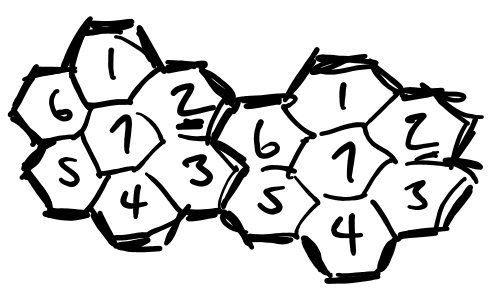

- Co-channel interferers are well separated due to the re-use pattern

**1G**

- 1980 NMT nordic mobile telecom
- 1983 amps advanced mobile phone service
- Analog FM voice
- Digital BPSK on control channel
- FDMA / FDD

**2G** - TDMA

- 1990-GSM-Big winner
- Digital voice, 9600 bps data
- Texting

**3G**

WCDMA - 2000

CDMA-2000

Both used CDMA / FDD -> TDD introduced important for 5G

**4G**

LTE - 2010

OFDM / FDD and TDD

Pachet vocie -> VoLTE

(Voice is now VoIP)

**5G**

NR - new radio 2020

new use cases

- EMBB enhanced mobile broadband
  - maxmize data rates > 1Gbps
- MMTC massive machine type comm
  - large numbers of devices
  - low cost, low energy, low data rate->OFDM makes this possible
- VRLLC (ultra reliable, low latency comm)
  - traffic safety -> autonomous vehicles
  - factory cutomatory
  - special link technologies make this possible

## Lecutre 2

==standards==

- interfaces
- protocols
  - messages
  - responses to events
- 3GPP advelops cellular standards
  - working groups
- ITU - International Telecom Union->national representatives
  - keep everyone organized
  - Governs use of spectrum
  - Includes placement of geosynchronous satellites

Celluar Spectrum (Chapter 3)

- more to higher bands
  - changes in propagation
  - smaller antennas -> massive mimo

**60 GHz** - oxygen line

-> limited propagation

​	good for small cells

​	great for small antennas（天线）

- Lower (<2GHz)

  600,700mHz

  20mHz Bandwidth

- medium (3-6GHz)

  3300-4200 mHz

  100 mHz Bandwidth

- Higher (>24GHz)

  millimeter ware

  24.25-29.5 GHz

  400 mHz Bandwidth

Current Aggregation

Use second bands at a time -> much higher data rates

**LTE/4G**

Release 8 (2008, implemented in 2009)

OFDM - was already in use in 802.11 (WiFi)

->orthogonal frequency division multiplexing

- multicarriers transmission

  - N subcarriers

  - Spaced in frequency as closely as possible, while still orthogonal

  - Orthogonality is a function of symbol rate

OFDM review - read bingham paper

Wireless - time dispension / delay spread

- multiple images received, variable delays
- intersymbol interferences (ISI)

Bit error rate becomes a function of ISI

-> increasing power does not help

**Solution**

- limit symbol rate on carriers to limit ISI
- Use multiple carriers to increaase data rate
- old idea - kineplex 1957
- Key technology - FFT 

Data -> Serial / Parallel -> IFFT -> D/A -> LPF(time domain waveform whose frequency components are data)

- Symbol rate per carrier is slower -> reduce ISI

- Place cyclic prefix is guard interval?
  - repreat end of last symbol in guard interval
  - makes linear convolution of received signal into a circular convolution->further reduces ISI

**LTE** subcarriers spacing 15kHz

- 15K symbols / sec / subcarriers
- 1200 subcarriers in 20 mHz
- cyclic prefix 4.7 us

*cyclic prefix should as long (induration) as the period of time over which the channel creates substantial replicas

- confined space -> small time dispersion

  ​               -> short cyclic prefix

- open areas -> larger time dispersion

  ​           -> longer cyclic prefix (less date rate)

Transmission Timings

1 radio frame = 10 one-millisecond subframes

1 subframe = 14 OFDM symbols

* subframe is smallest schedulable unit in LTE

1 subframe = 2 slots

1 slot = 0.5 ms = 7 symbols (normal cyclic prefix)

​                = 6 symbols (extended cyclic prefix)

Resource block = 12 subcarriers x 1 slot

Resource element = 1 subcarriers x 1 slot

-  We vary date rate by varying number of assigned resource blocks

- Not all subcarriers are used

  - fading

  - reference signals

    pilot symbols provide info needed for coherent demodulation (demodulation requiring phase information)

  - reference signals are known complex values in known places in the OFDM time/frequency grid. Values are a function of cell ID and location in grid

---

Contributions to data rate

- resources blocks assigned

  - modulation format QPSK -> 64QAM

- error control 

  - turbo coding

  - LDPC (low density paradity check)

  - Polar codes (control plane)

  - Fast-HARQ with soft combining 

    Hybrid-Automatic-Repeat-Request

**modulating**

- varying frequency, phase, and/or amplitude in accord with information

QPSK  Quadrature - PSK

16-Quadrature Amplitude Modulation (16-QAM)

64 QAM -> 6 bits symbol

7 symbols/slot/subcarriers

12 subcarriers/resource block

84 symbols/slot/resource block

Example 16-QAM

4 bits/symbol -> 84*4 = 336 bits/slot/resource block

2 slot/ms -> 672 bits/ms/RB

Rate 1/3 turbo code -> 224 kbps/RB

1200 subcarriers in 20mHz -> 100 RB -> 22.4 mbps / 20 mHz

**Scheduling**

Uplink assignment once per ms

- prorided on physical downlink controol channel (PDCCH)

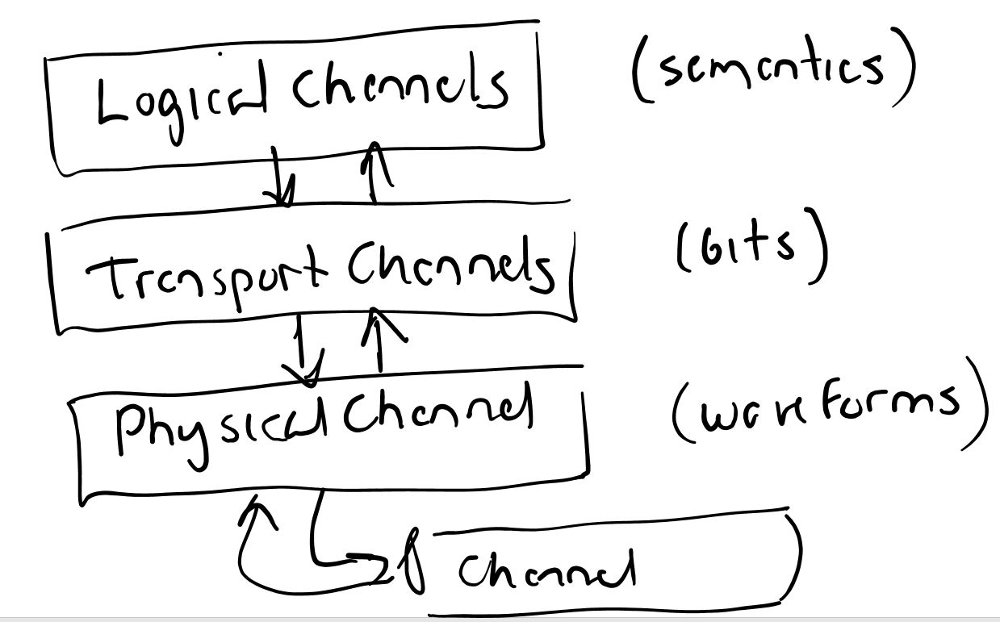

PDCCH - up to first 3 symbols of each subframe full BW of 20mHz

PUCCH - uplink - 1ms

​	ACICs, NACKs, CSI (channel stak information)

## Lecture 3

MIMO (multiple input/multiple output)

$N_t,N_r$ are transmit antenas and receive antenas 

We cab create up to min($N_t,N_r$)transmission layer

->independent paths from transmitter to receiver

- Diversity -> better BER performance
- Spacial multiplexing -> higher data rates

transmission rate = $N_L$ = layers

Closed loop spatial multiplexing

- CSI(channel state information) used to update channel estimates
- select precoders matrices->precoding makes layers look like independent channels

Release 8 Bcsics

- peak 150mbps donlink with 2 layers in 20mHz BW
- 75mbps in uplink (1 layer)
- overall latency - 10ms (100ms max tolerance for voice)

Release 10 - lake 2010 "Evolution"

           - carrier aggregation
           - advanced mimo
           - relaying

Release 13 - "LTE advanced pro"

- 4.5G
- Licensed-assisted access to unlicensed spectra
- enhanced carriers aggregation / mimo

**Carrier aggregation** - A big success

Release 10 - Up to component carriers -> up to 100mHz total

Later we get up to 32 component carriers->up to 640 mHz

Fragmented spectra -> batches of subcarriers not contiguous

License assisted - "gentle" use of ISM bands using cellular air interface

MIMO enhancements

"Full dimension mimo"

- increase CSI
- spatially separated devices can use the same time/frequency resources->beamforming

Densification (relaying)

- relaying: relay cell that looks like UE (user equipment) to the donor cell

**Heterogeneous Deployments**

​               microcells - neighborhood

​               femtocells - residence

- small cell on/off -> micro/femtocells can be turned off to reduce interference

**Dynamic TDD**

​                         **Duplex** - two way channel

​                         **FDD** - Frequency division

​                         **TDD** - time division

- same carriers freq. used for uplink and downlink
- change configuration -> allocation of resources varies

New Scenarios

- Device to device -> important for low-coverage areas
- Machine type communication
  - narrow band IoT (Release 13) < 250 kbps

**NR Overview / Chapter5**

main benefits of 5G over LTE

- exploitation of much higher frequency bands
  - aggregating
- Ultra-?le design in over the air (OTA) protocol
  - minimize **always-on** approach
- forward compatibility
- low latency -> expands use cases
- extensive use of beom forming 
  - strong need for CSI

**Radio-Interference Architecture / Chapter 6**

Key issue: split between radio access netork (RAN) and core network (CN)

RAN-radio-related functionality

- scheduling
- link technologies
  - HARQ protocols
  - coding
  - mimo

CN-infrastructure, non-radio

- authentication
- end-to-end connections
- charging / rules function

LTE Core - envolved packet core (EPC)

5G-RAN->EPC

​      ->5G CN (evolutionary path)

EPC -> 5GCN

- services-based architecture
- network slicing support
- control plane / user plane split

**Service-based architecture**

- focus on service/functionality/process instead of nodes/services -> services are more transportable/flexible

Network slicing

- Dates back to PSTN
- slice = logical network with necessary functions for customers   -> virtual networks
- multiple slices may run on same services

Control Plane / user plane split

- independent scaling

**5G RAN**

gNB - g node B - base station

​      part of both user/control plane

ng-eNB - next generation e node B

   - LET user/control planes

Can cover several cells

- logical node, not a physical device

AMF = access and mobility management functions

UE (user equipment) connectivity example

Dual connectivity - connections through multiple cells ( not as tightly coupled as carriers aggregation)

**Quality of Service (QoS)**

Voice-low data rate, high BER, low latency application

Streaming video - low BER, high latency

Email - medium BER, high latency 

QCI = QoS class Identifies

  1 = Voice

  6 = Data

  8 = throttling

Connected Device

- PDU sessions
  - QoS flow
  - data radio readers ?

## Lecture 4

**Radio Architecture**

Apps - user interface

​	IP packets

Apps -> mapping to QoS flows (UPF) -> mapping to radio bearers (gNB) -> channel -> UE

SDAP - service data app protocol

packets marked with quality flow identifiers (QFI)

User plane protocols (Downlink)

​                       QoS flows

user plane protocol -> SDAP -> PDCP (packet data convergence protocol) Header component -> RLC (radio link controller) segmentation ARQ -> MAC, multiplex and HARQ -> PHY

- segmentation: breakets packets up into transport blocks
- ARQ - automatic repreat request

- MAC - medium access control
- HARQ - Hybrid-ARQ

Service Data application protocol (SDAP)

- mao QoS flows to data radio bearers
- marks packets with QFI

Packet Data convergence protocol (PDCP)

- IP header compression (ROHC)
- encryption
- duplicate removed
- re-ordering for insequence delivery
- re-transmisssions of uplink packets not delivered due to handover
- dual connectivity
  - handles split between mater and secondary cell groups

**RLC**

- segmentation of RLC SDU's into RLC PDU's
- modes
  - transparent mode (no headers added)
  - unacknowledged mode (segmentation, duplicate detected)
  - acknowledged mode (ARQ)

Segmentation - Fill up transport block

             - update headers to denote segemtned SDU

ARQ 

- Included on RLC and MAC
  - RLC - sequence based, detects missing packets
  - MAC - detects symbol errors -> faster

MAC

logical channels (symantics)

- broadcast control channel (BCCH)
  - system information

- paging control channel (PCCH)
  - Notification of incoming calls
  - based on multiple cells / location area
- Common control channel (CCCH)
  - Control info related to random access
- Dedicated Control channels (DCCH)
  - Device configuration
- Dedicated Traffic Channel (DTCH) -> traffic channel
  - uses Data

Logical Control Channel (BCCH, PCCH, CCCH, DCCH)

---

Radio Interface Architecture 

logical channels -> semantic context

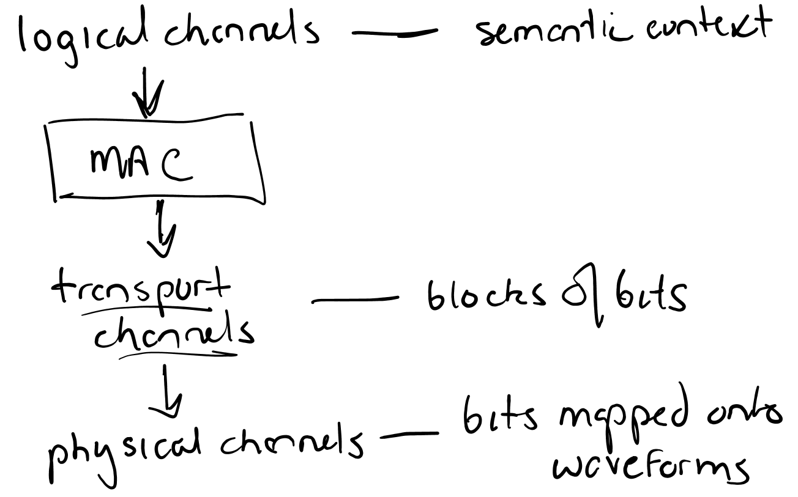

Transport Channels

-> transport blocks

- one per transmission time interval = 1.0 ms

  (if layers <= 4)

- two transport blocks per TTI when layers >= 4

- TTI is scalable in 5G to reduce latency

-> Transport format (TF)

- size of blocks
- modulation and coding
- antenna mapping

All above three determines data rate

**Types of Transport Channels**

- Broadcast channel (BCH)
  - Fixed TF
  - Conveys master InFo blocks (MIB)
- Paging channel (PCH)
  - paging info
  - supports DRX (discoutinuous reception)
    - sends info at predetermined times
    - handset can power down periodically

- Downlink shared channel (DL-SCH)
  - man transport channel for downlink user data
  - dynamic rate adaptation
  - channel dependent scheduling
  - spatial multiplexing
  - HARQ with soft combining
- Uplink shared channel (UL-SCH)
- Random access channel (RACH)
  - no transport blocks

## Lecture 5

SDAP (service data app protocol) -> apply QFI to each packet

PDCP 

dual connection ?

RLC (radio link controller)

ARQ (?)

HARQ

Carrier aggregation

Error control

**Downlink**

- logical channels (PCCH, CCCH, DTCH, DCCH)
- transport channel (PCH, BCH, DL-SCH)
- physical channel (PBCH, PDSCH, PDCCH)

**Uplink**

- logical (CCCH, DTCH, DCCH)
- transport (UL-SCH, RACH)

- physical (PUSCH, PUCCH, PRACH)

**MAC control element**

- inband control signalling
- scheduling info
  - buffer status report (BSR)
  - power headroom -> indicators to how much faster you can transmit

**Random Access Info**

- C-RNTI (Radio network temporary ID)
- Contention resolution

**Timing advances**

- DRX discontinuous reception and control -> save battery power

**MAC Data distribution**

...

==Carrier Aggregation==

- tight connectivity

- same gNB

- joint scheduling

==Dual connectivity== 

- looser coordination
- potentially different gNBs
- potentially different Radio access

**Scheduling**

- Book includes this in MAC discussion
- dynamic scheduling - once per slot
- uplink scheduler
  - which devices tend to use UL-SCH
  - which resource are allocated?

==gNB== does not decide which data will be transmitted on the uplink

- which radio (barrier?)
- which apps?

==details of scheduling are not in standard==

- downlink channel-dependent scheduling
  - Uses CSI
- Uplink
  - BSR, Power headroom

**Hybrid-ARQ with soft combining**

ARQ (automatic repeat request)

- combines error correction and detection
- soft combining (physical layer) ? -- 
- "Soft" 

---

Lecture 5B

**Control Plane Protocols**     Non-Access stratum/control plane (NAS)

- connection setup         Access and mobility function (AMF)
- mobility
- security

- Authentication
- security (Crypto-preventing surveillence)
- idle mode processors (e.g. paging)

Assignment of IP address

**Radio Resource Control Plane** (Access Stratum)

RAN-control function

- broadcast of system info
- transmission of paging messages
- connection management
- mobility management (cell selection)

measurement/config. reporting

RRC messages use radio signal bearers

- CCCH (during connection establishment)
- DCCH (after connection established)

**RRC state machine** 

first- RRC idle

- no data transfer
- no RRC context
- no core network connection
- devices controlled mobility

second - RRC inactive (**New to 5G**)

- no data transfer
- RRC context
- core network connection
- device controlled mobility

third - RRC connected

- data transfer

- RRC context
- core network connection
- network controlled mobility

4G/5G apps generate lots of small packets 

- frequent transition to RRC_connected
- RRC_inactive (new to 5G) speeds this up (no core network signalling needed)

Mibility Management

- network keeps track of your location
  - knows where to send paging messages -> registration message
- Privacy issue 
- Idle and inactive states
  - handset searches for cell with best signal

- Handset listens for nearby broadcast channels (PBCH)
- Handset reselects cell if power sufficiently higher than correct cell -> Random access notification to network (no connection) -> PRACH

Paging over entire network -> waste of resources in celluar

Page only in current cell -> overhead is high if user has moved

-> work with groups of cells

cell -> RAN areas (RAI-tracking basis) -> Tracking areas (TAI-tracking basis for core network)

​			Paging indicator - radio network temporary identifier

Paging 

- indicated by PI-RNTI within downlink control info (DCI)
- when hanset sees PI-RNTI, handset goes to PDSCH to extract paging information

Mobility Management - connected states

- device continually listening to new cells 
  - device reports power measurements
  - network decides to which cell to hand you off (likelihood of dropped calls -> 0%)

Transmission Structure (Chapter 7)

OFDM uses the cyclic prefix

why?

- isolated distinct OFDM blocks from each other when channels is fading
- Turns linear convolution into circular -> allow single-tap equalization 

CP is a copy of the end of the symbol

- channel response over CP is the same as response at end of symbol
- looks like convolution at end of FFT window is the same as that of the front

## Lecture 6

Numerology of the Waveform

- subcarriers spacing
- CP (cyclic prefix) length

large subcarriers spacing -> reduced impact of frequency error and phase noise -> requires fast symbol rate -> shorter duration for each symbol -> increased overhead from CP

LTE -> 15kHz subcarriers spacing

​       CP = 4.7us

​       Good for outdoor celluar up to 3GHz carriers freq.

4.7 us -> 0.87 miles at speed of light

large cells -> large CP

high frequencies -> shorter CP (<4.7us)

small cells

Scalable Numerology

| subcarrier spacing (Khz) | Useful symbol time (us) | cyclic prefix (us) |
| ------------------------ | ----------------------- | ------------------ |
| 15                       | 66.7                    | 4.7                |
| 30                       | 33.3                    | 2.3                |
| 60                       | 16.7                    | 1.2                |
| 240                      | 4.17                    | 0.29               |

There exists an extended CP to allow for extreme time dispersion

Time Domain Structure

Frames - 10 ms -> Subframes - 1 ms -> Slots - 14 OFDM symbols -> defined by fixed of symbols

| $\Delta$ F | Slot time |
| ---------- | --------- |
| 15KHz      | 1 ms      |
| 30         | 0.5 ms    |
| 60         | 0.25 ms   |
| 240        | 0.0625 ms |

To improve latency, slot need not be full

- manufacturing/safety
- self-driving cars

-> mini-slot transmission (new use case -> low latency (high reliability))

- Also useful for use in unlicensed spectrum
  - listen before transmit
  - transmit immediately when UL spectrum is free

Frequency Domain Structure

"DC subcarriers" - device center frequency

- fixed location for LTE

- problematic due to local oscillate leakage
- vary DC subcarriers due to variation in a available subcarriers

Resource Element in LTE

- one subcarrier, one OFDM symbol

Resource Block

- 12 consecutive subcarriers
  - one dimensional 
  - flexible transmission times

Common Resource Blocks (CRBs)

- Run from CRB0 to max RB for a given subcarriers spacing
- First subcarriers of CRB0 is Point A
  - common reference points
  - all RBs start here

Physical Resource Blocks

- defined in a bandwidth part
- defined actual transmitted signal

In LTE, all devices support 20MHz BW

In 5G, we allows for much larger BWs

- some devices can't do it all
- vary/very expensive to require control signals across entire BW

Receives BW adaptation

-> use narrow BW for monitoring control signals

Bandwidth Parts 

- subcarriers spacing 

                - cyclic prefix
                - set of consecutive RBs starting at a certain CRB

Carriers Aggregation 

Major emphasis -> non-contiguous blocks of carriers in the frequency domain 

3 scenarios:

- intra-bend aggregation, contiguous subcarriers
- intra-bend aggregation, non contiguous subcarriers
- inter-bend aggregation, non contiguous subcarriers

"Carriers" = collection of contiguous subcarriers that are modulated together (by an FFT modulator)

Up to **16** carriers allowed for carriers aggregation

-> 16*400MHz = 6.4GHz max allocation 

mechanics are cell-based

- primary cell (P cell)
- initial point of connection (initial access)

-secondary cell

- after connection
- added bandwidth

Duplex Schemes

modes? of communication

- simplex: one way only
- half-duplex: two-way but only one wau at a time
- duplex: two ways same time

 

Frequency Division Duplex (FDD)

- uplink and downlink on different frequencies
  - requires separation of frequency $\Delta$ F

Time Division Duplex (TDD)

- uplink and downlink on same carriers freq.

Half Duplex FDD - uplink and downlink separated in freq and time

Slot formats

3 major issues (allocation by network scheduler *network controlled)

- uplink
- downlink
- flexible switching time

TDD

- Not use in north american celluars
  - legacy reasons
- LTE does allow for TDD in standard - Fixed configuration

5G - dynamic 

- switching point can be in the middle of a slot 
- semi-static until dynamic are needed 

Switching time ~ 20 us (function of circuitry)

TDD is wave of the future -> easier at high frequencies

FDD uplink and downlink mostle isolated

---

Channel Sounding - **Chapter 8**

Critical to LTE/5G

detailed frequently updated information on channel quality

-> channel efficiency

-> supports MIMD

How do we obtain this info?

- measurements taken on known signals (reference signals)
- count retransmission requests
- blind estimation

5G uses known signal measurements 

- channel sounding

**Downlink Channel Sounding**

LTE (R8) - cell specific reference signal (CRS)

- LTE CRS are transmitted over entire carriers
- one per subframe (1ms)
- cell specific - transmitted sequence is a function of the cell id
- always on

LTE (R10)

- Channel state Info Reference Signals (CSI-RS)
- Not always transmitted
- LTE devices are configured by network to measure a set of CSI-RS

5G-NR -only uses CSI-RS

​      extended to beam management and mobility

CSI-RS -up to 32 antena ports

​         port < > channel to be sounded  

gNB sends command to configure UE to listen to a particular set of reference signals

single port CSI-RS -one RE x 1 slot

multi-port CSI-RS -multiple, orthogonally transmitted per-port CSI-RS sharing a set of RE'S

sharing - code domain (CDM)

​	separation achieved through or thogonal spreading patterns

​    frequency domain (FDM)

​	time domain (TDM)

multi port CSI-RS association between per-peort CSI-RS and port numbers

- CDM, then FDM, then TDM

Freq. Domain structure of CSI-RS

- CSI-RS is confined to 1 bandwidth port
  - same numinology as BW ports

Density 1-CSI-RS sent in many pi source block 1/$\tau$ every other RB

Time Domain

- periodic every N slot
- semi persistent periodic but can turn it on and off (MAC control element)
- aperiodic: turn on and off by signalling in DCI

**CSI-IM Interference Measurements**

CSI-RS - basic idea for IM listen to known signal, subtract out expected value

CSI-IM - nothing is transmitted

These CSI-RS are non-zero power (NZP)

- device is scheduled on PDSCH reception and is configured for CSI-RS

Zero-Power CSI-RS

What if resource block includes CSI-RS for someone else?

NZP-CSI-RS: Device assumes actual transmission and performs measurements

ZP-CSI-RS: Device only knows set of resource blocks to which POSCH is not mapped *no assumptions*

 

**Tracking Reference Signals (TRS)**

- Designed to detect oscillator imperfections
- TRS is a resource set consisting of
- multi periodic NZP-CSI-RS
- time domain separation -limits frequency error
- freq. domain separation - timing error limit

**Downlink Measurement and Reporting**

- Channel Quality Indicator (CQI)
- Ronk Indicator (RI)
- Precoder Matrix Indicator (PMI)

Sometimes

- Received Signal Received Power (RSRP)

CSI Report Configurations (Ordered gNB)

- quantities to be reported
- downlink resources used for measurement
- reporting mechanism 
  - format
  - uplink channel

**Resource**

Associate resource configuration with at least one NZP-CSI-RS resource set

- link adaptation, multi-antenna precoding uses single port CSI-RS
- beam management - multiple CSI-RS

**Reports**

periodic - PUCCH

semipersistent - PUCCH PUSCH

aperiodic - PUSCH

**Uplink Channel Sounding**

Sounding Reference Signals (SRS)

- uplink equivalent of CSI-RS, except ...
  - limited to four antenna ports
  - limited PAR (peak-average TX power ratio)

SRS uses a comb structure

## Lecture 7

### Transport Channel Processing

*Physical layer provides services to the MAC in the form of transport channels

- Downlink - DL-SCH  -PCH  -BCH

- Uplink -UL-SCH

With each TTI, one or two transport blocks are transmitted

$>$ 4 layers -> 2 blocks 

$<=$ 4 layers -> 1 block

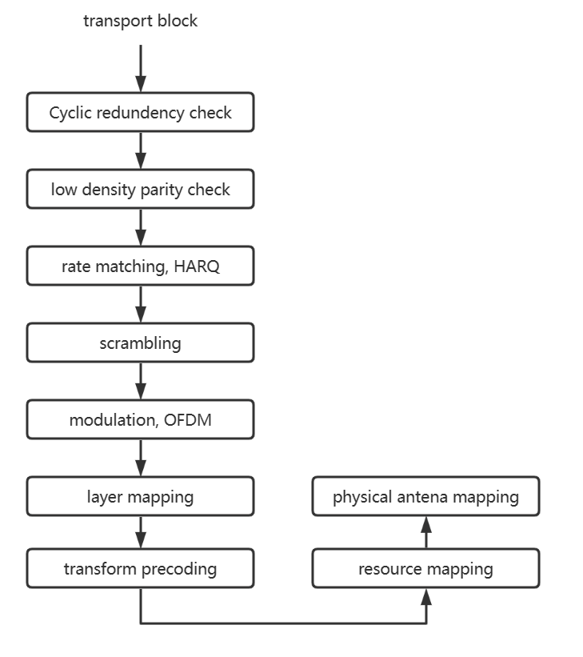

### Channel Coding

- Insert redundency so that the receivers can detect or correct errors 

- error detection: determine the error are present without trying to correct

Error detected? 1. request retransmission 2. mute the data/packet 3. trying to correct them

### Error detection: Parity Check

-> add a bit so that the total number of ones in the block is odd or even

CRC - more powerful - we add 4, 8, 16 32 extra bits that are a function of the data block

### Error correction

- use redundancy symbols to attempt to correct errors that occur during transmission

### Low density parity check

original idea: Rdoct? Galla?  1962 PhD thesis

- Basic idea: each row and column of a generator matrix  have a fixed number of ls?
- Decoding  Belief Propogation (1982)  |  the following two called turbo coding
  - message passing algorithm
  - drive estimates of p(x,i)  by optimal exchange of parity info

###  Hamming Code: 1948

$\bar C$ is a code word  $\Leftrightarrow$  $\bar C H^T = \bar 0$

$H$ is a  parity check matrix

$H= \left( {\begin{array}{*{20}{c}}
1&1&0&1&1&0&0\\
1&0&1&1&0&1&0 \\ 0&1&1&1&0&0&1\end{array}} \right)$

$G=\left( {\begin{array}{*{20}{c}}
1&0&0&0&1&1&0\\
0&1&0&0&1&0&1 \\ 0&0&1&0&0&1&1 \\ 0&0&0&1&1&1&1\end{array}} \right)$

$\bar m = [m_0,m_1,m_2,m_3]\Rightarrow \bar c = \bar m G \\ m=[1,1,0,0] \leftrightarrow \bar c = [1,1,0,0,0,1,1]$ 

single error correcting code

Bipartite Graph: $G=(V_1\cup V_2) $ is a graph with two disjoint set of vertices such no two vertices is the sameset are adjacent

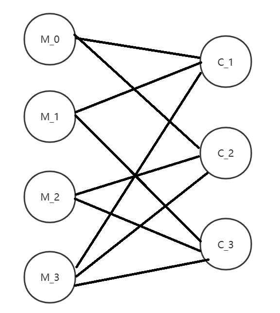

Message passing algorithm determine likely values of $m_0,m_1,...,m_n$

### LDPC in the standard

Two basic graphs

BG1-coderates, $\frac{1}{3} \sim \frac{22}{24}$ (large blocks) 

BG2-coderates, $\frac{1}{3} \sim \frac{5}{6}$ (small blocks)

 code rate = $\frac{k}{n}$, k-info bits, n=length of codeword, code rate $\downarrow$, error control $\uparrow$ 

### Code block segmentation

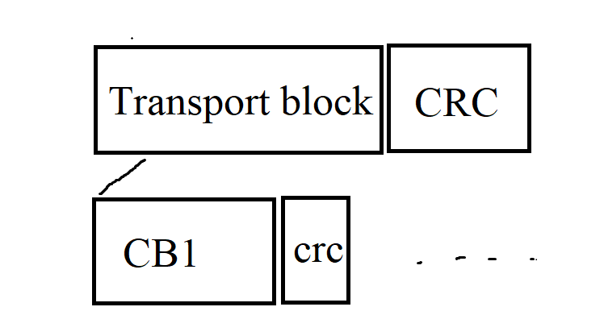

**Rate matching and HARQ**

- variable rate achieved through "puncturing" (deletion of parity bits)

**Scrambling**

- multiply sequence of bits by a scrambling a sequence
  - different sequences in adjacent cell s -> randomizes sources of interference

### Modulation

srambled bits -> complex modulated signals 

- QPSK
- 16-QAM
- 64-QAM
- 256-QAM

### Layer mapping

multiple layers -> multiple bit streams 

Transofrm precoding

uplink only -> reduced peak to average power -> more efficient omps

**molti antenna precoding**

map transmission layers to antenna ports

- mapping done by precoding matrix

---

==Chapter 11==

### Reference Signal

**RS**-predefined signal occupying predefined, resource elements **in the down link**

**LTE**-always on, cell specific, used for coherent demodulation, channel quality estimation, time/freq tracking.

**5G** - different RS for different purposes -> optimization

**NR reference signal**

*Demodulation reference signal (DM-RS)

DL-only in RBs (resource blocks), used for PDSCH, -> for coherent demodulation, ->phase info to help distinguish symbols

UL-DM-RS for PUSCH allows gNB to coherently demodulate PUSCH (a uplink channel)

**Phase tracking (PT-RS)**

- used to compensate for **phase noise**
  - denser in time, but sparse in frequency than DM-RS
- Non-linear amps (amplifier) are more efficient/use
  - less battery power->But they can convey? amplitude noise into phase noise

**CSI-RS**

- used by devices to acquire channel state information

**Tracking reference (TRS)**

- Time and frequency tracking
- Sparsely allocated

**Sounding reference**

- uplink reference signals for channel estimation 

**DM-RS**

- front loaded to reduce latency
- up to 12 orthogonal  atenna ports
- up to 4 RS per slot for very high speeds

**mapping**  **A** (assume most of slot used)

A-first DM-RS is in symbol 2 or 3 of the slot -> ==CORESET== at beginning of slot

**mapping B** (assume only small part of slot is used)

B-first DM-RS is first symbol of allocation to slot

use length ($2^{31} - 1$) Gold sequence

### Physical Layer Control Signals

- L1/L2 control signals support transmission of uplink and downlink transport channels
- Downlink 
  - scheduling assignments for UL used by handset -> how to interpret on DL-SCH
- NR allows for one DL control channel, PDCCH

**PDCCH**

- location varies
  - search  spaces defined in terms of control resource sets (CORESETS)

Downlink Channel Information (DCI)  34 min 50 s 

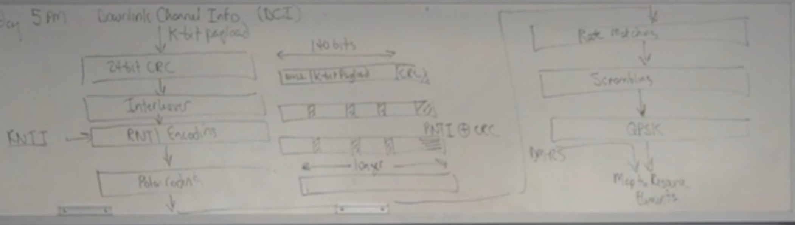

**RNTI** (Radio Network Temporary ID)

- 16 bits 
- differentials CEs or groups of UEs
- different types 
  - C-RNTI = cell RNTI -> dedicated to a UE with a given cell
  - P-RNTI = paging RNTI -> 0xFFFE

**Polar coding**

polarization through spreading is used to create N channels with property that p * N operate near capacity and $(1-p) N$ are operate near 0-capcacity -> capacity-achieveing channels for signaling -> channels defined in terms of code sequence

**Control Resource Set (CORESET)**

- A time/frequency resource in which the UE tries to decode possible control channels
- Flexbile structure allows for variable BW capabilities and needs of individual cells
- Cell-level configuration facilities reuse of CORESETS between BW ports -> BW ports flexibility 
- CORESET indicates where a device may find/receive PDCCH transmissions 
  - may not be there. ..

Common design choice: locate CORESET at beginning of slot, best for per-slot scheduling decisions

**PDCCH reception**

- Devices uses reference signals associate with candidate PCCH to form  channel estimate (single antenna port used)
- DM-RS mapped into every 4th subcarriers
- seach spaces by trying to decode PDCCH candidate

If CRC is valid, you have found the PDCCH

CORESET -> define PDCCH search space 

CRC -> tells us when we found it !

**Downlink Scheduling Assignments**

formats 1-0 and 1-1

- Identifiers: downlink assignment or uplink grant?

- Resource information 
  - carriers indication ( if > 1)
  - BW part indication
  - frequency domain allocation -> which resource blocks contain PDSCH for this user
  - time domian allocation

- Transport block Info
  - modulation encoding, transport block size
  - new data (clear soft buffer)
  - presence of 2nd block

**Hybrid ARQ Info**

- process number 
- feedback timing 
- code block group identifier 

**Multi antenna Info**

- antenna ports
- SRS requests (estimate quality of uplink channel)
- DM-RS initialization

PDCCH Info

- resource indicator
- power control bits

**Uplink Scheduling Grents** PUSCH

Formats 1-0, 1-1

similar info

Uplink L1/L2 control signalling 

- HARQ acknowledgement
- CSI
- Scheduling requests

## Lecture 8? 3/15

MIMO

SVD $\rightarrow$ multiple independent paths between transmit and receive antennas

1. diversity
2. spatial multiplexings / any combination

Number of Layers = $min\{N_T,N_R,rank(H) \}$

**MIMO implementations**

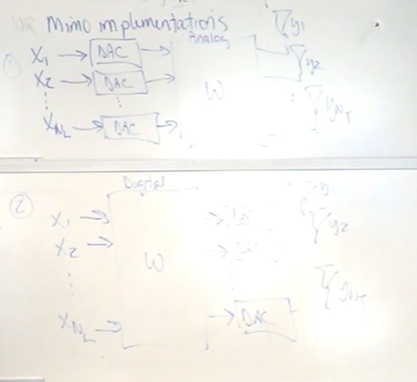

W is easy to design, DACs are high frequency -> more expensive

**Downlink**

CSI reports

- RI - rank indicator, estimate as to approprite layerss
- PMI - precoding matrix indicator, estimate precoding
- CQI - channel quality indicator, estimate of the size of the transport block that can be set with 90% with no errors

Each possible value of PMI corresponds to one specific precoding matrix

available values = precoding codebook

precoding applies for each combination of numbers of antenna parts and number of layers

*In 5G arbitrary precoding matrices selected by TX and RX

**MIMO - multi-uses**

- choose matrices that not only focus energy in a given uses, but also limit adjacent interference

Type1-CSI  - a single uses is scheduled (no mu-MIMO), allows for higher-orders spatial moltiplexing

Type2-CSI -  mu-MIMO scenarios  2 layers per users

Type-I Single Pannel CSI 

**multi-pannel CSI** 

$w_1$ are beam per polarization  pannel

$w_2$ subband co-phase as well as pannels

codebook precodes matrices 

**Uplink**

NR- support uplink (PUSCH) multi-antenna precoding up to layers

codebook based 

non-codebook based 

*Channel raciprocity

**Chapter 12 Beam Managment**

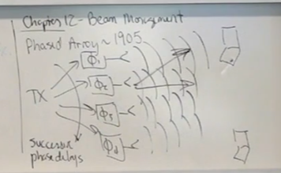

Typical Antenna Patterns

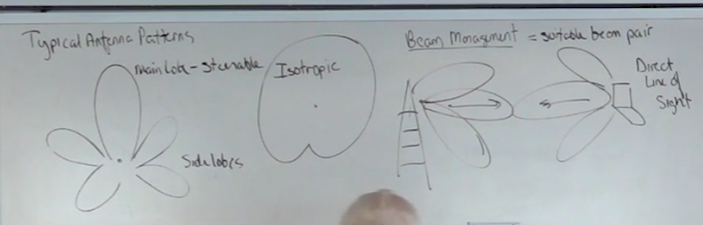

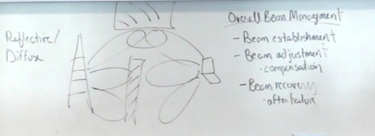

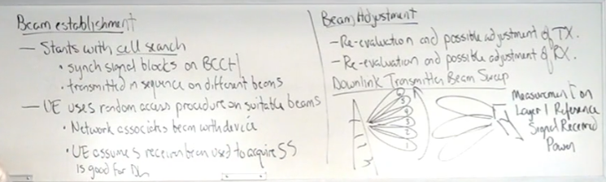

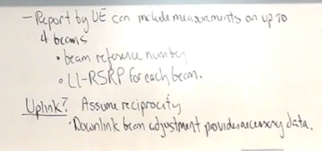

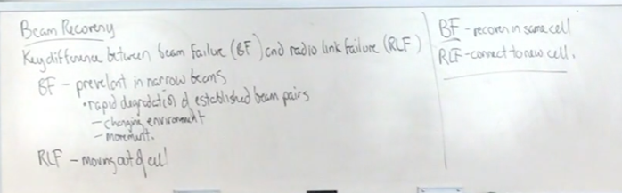
